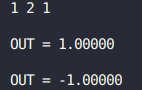
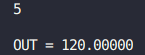
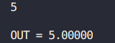
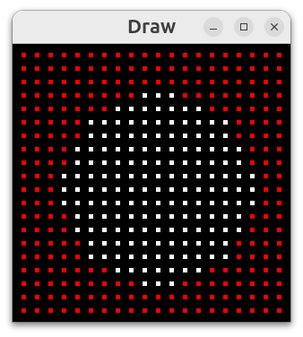

# Функциональный симулятор процессора

Суть задачи заключалась в том, чтобы написать свой язык ассемблера и реализовать программы, которые бы переводили его в бинарный вид, исполняли бы бинарные вид и имели возможность дизассемблировать этот вид в первоначальное состояние.

## Реализация

### Считывание программы и перевод в бинарный вид

При запуске считывалась программа из входного файла, каждая команда переводилась в двоичный вид по особому принципу и записывалась в буфер, который в конце программы записывался в выходной файл вместе с его размером.

#### Представление команд

Команда кодировалась **одним байтом**. **5 старших битов** определяли номер инструкции, **6-ой бит** определял доступ к памяти при выполнении этой инструкции, **7-ой бит** - использование регистров, а **8-ой бит** - использование числа. После этого записывается номер регистра, использованного в инструкции, а после него - использованное число.

```
|           Байт, кодирующий инструкцию         |
|  1  |  2  |  3  |  4  |  5  |  6  |  7  |  8  | - биты числа
|      Значение инструкции    |  M  |  R  |  I  |

M - Бит, определяющий доступ к оперативной памяти (0 -нет доступа, 1 - есть доступ)
R - Бит, определяющий использование регистров (0 -не используются, 1 - используются)
I - Бит, определяющий использование числа (0 -не используются, 1 - используются)
```

### Исполнение программы

Перед исполнением из файла считывается размер программы и её бинарное представление. Затем программа запускается с **нулевой** инструкции и исполняется, пока не встретит инструкцию завершения программы.

Для реализации стека был использован другой мой проект [Stack](https://github.com/Dinichthys/Stack)

### Дизассемблирование

Перед дизассемблированием из файла считывается размер программы и её бинарное представление. Затем происходит последовательный перевод закодированных инструкций в их строковый вид, а так же декодирование номеров регистров и чисел, с которыми идёт работа.

В случае, если инструкция перехода (``jmp``, ``ja``, ``je``, ``call`` и так далее), то вместо метки подставляется адрес инструкции в бинарном представлении, куда следовал бы этот переход (такой вид в моём ассемблере так же поддерживается, дизассемблированная программа может быть запущена и её поведение не изменится).

## Использование

Для использования требуется скачать графическую библиотеку **SFML**, так как данная программа поддерживает графический вывод данных, хранящихся в оперативной памяти.

### Реализованные инструкции

| Имя инструкции | Её значение
| :---:          |:---:
|      PUSH      | Положить значение числа/регистра/ячейки оперативной памяти в стек
|      POP       | Достать значение из стека в регистр/ячейку оперативной памяти
|      ADD       | Сложить два верхних числа на стеке и положить результат в стек вместо них
|      SUB       | Из верхнего элемента стека вычесть следующий за ним и положить результат в стек вместо них
|      MUL       | Умножить два верхних числа на стеке и положить результат в стек вместо них
|      DIV       | Верхний элемент стека разделить на следующий за ним и положить результат в стек вместо них
|      SQRT      | Взять квадратный корень из верхнего элемента стека и положить результат в стек вместо него
|      SIN       | Взять синус верхнего элемента стека и положить результат в стек вместо него
|      COS       | Взять косинус верхнего элемента стека и положить результат в стек вместо него
|      IN        | Получить число со стандартного потока ввода ``stdin`` и положить на верх стека
|      OUT       | Вывести значение верхнего элемента стека в стандартный поток вывода ``stdout`` и убрать его со стека
|      DUMP      | Вывести в ``stderr`` информацию о стеке и содержимом оперативной памяти, регистров и счётчика инструкций **IP**.
|      JMP       | Безусловный переход по метке или конкретному адресу
|      JA        | Условный переход (выполняется, если значение верхнего элемента стека больше следующего) по метке или конкретному адресу
|      JAE       | Условный переход (выполняется, если значение верхнего элемента стека больше или равно значению следующего) по метке или конкретному адресу
|      JB        | Условный переход (выполняется, если значение верхнего элемента стека меньше следующего) по метке или конкретному адресу
|      JBE       | Условный переход (выполняется, если значение верхнего элемента стека меньше или равно значению следующего) по метке или конкретному адресу
|      JE        | Условный переход (выполняется, если значение верхнего элемента стека равно значению следующего) по метке или конкретному адресу
|      JNE       | Условный переход (выполняется, если значение верхнего элемента стека не равно значению следующего) по метке или конкретному адресу
|      CALL      | Вызов функции по метке
|      RET       | Возврат из функции на инструкцию, следующую после вызова
|      DRAW      | Отрисовка оперативной памяти в отдельном окне, а потом, если это необходимо, можно вывести в стандартный поток вывода ``stdout`` запись оперативной памяти в виде текста (для этого надо будет написать ``T``, когда об этом Вас спросят в этом же потоке)
|      MEOW      | Вывод в стандартный поток вывода ``stdout`` слова ``meow`` такое количество раз, какое значение лежит наверху стека
|      BARK      | Вывод в стандартный поток вывода ``stdout`` слова ``bark`` такое количество раз, какое значение лежит наверху стека
|      HLT       | Завершение программы

### Запуск программы

Далее начала надо собрать проект командой ``make``.

Для использования достаточно написать программу в отдельном файле, затем запустить
``` bash
./compiler Ваш_файл.asm program_code.txt
```
или
``` bash
./compiler Ваш_файл.asm Имя_выходного_файла.txt
```

Затем для запуска программы нужно использовать команду
``` bash
make run
```
если имя выходного файла было ``program_code.txt``, или вызвать исполнение напрямую с помощью
``` bash
./processor Имя_выходного_файла.txt
```

Для того, чтобы воспользоваться дизассемблером, нужно использовать команду
``` bash
make disasm
```
тогда дизассемблированная программа появится в файле ``disasm.asm``, но это сработает только если имя выходного файла было ``program_code.txt``, или вызвать исполнение напрямую с помощью
``` bash
./disassembler Имя_выходного_файла.txt Имя_дизассемблированного_файла.asm
```

## Примеры программ

В папке [Files_asm](Files_asm) лежат файлы с примерами программ, написанных с использованием данных команд.

### Решатель квадратных уравнений

В файле [Files_asm/square_solver.asm](Files_asm/square_solver.asm) лежит программа, которая принимает на вход три числа, являющихся коэффициентами квадратного уравнения, и выводит количество его корней и сами корни.

Для запуска надо использовать
``` bash
make square_solver
```

Вывод программы:



### Факториал

В файле [Files_asm/factorial.asm](Files_asm/factorial.asm) лежит программа, которая принимает на вход одно число, а затем рекурсивно считает факториал этого числа и выводит результат.

Для запуска надо использовать
``` bash
make factorial
```

Вывод программы:



### Фибоначчи

В файле [Files_asm/fibonacci.asm](Files_asm/fibonacci.asm) лежит программа, которая принимает на вход одно число, а затем рекурсивно считает элемент последовательности Фибоначчи с индексом, равным этому числу и выводит результат.

Для запуска надо использовать
``` bash
make fibonacci
```

Вывод программы:



### Отрисовка круга

В файле [Files_asm/.asm](Files_asm/circle.asm) лежит программа, которая заполняет оперативную память так, что при её графическом выводе получается круг.

Для запуска надо использовать
``` bash
make circle
```

Вывод программы:



## Возвращаемые значения функций

|Имя ошибки        | Её номер | Её значение
|:---:             |:---:     |:---:
|    DONE          | 0        | Корректное завершение
|    CANT_CREATE   | 1        | Не удалось создать стек
|    CANT_DESTROY  | 1 << 1   | Не удалось удалить стек
|    CANT_RESIZE   | 1 << 2   | Не удалось изменить размер стека
|    CANT_PUSH     | 1 << 3   | Не удалось добавить элемент в стек
|    CANT_POP      | 1 << 4   | Не удалось достать элемент стека
|    CANT_DUMP     | 1 << 5   | Не удалось вывести информацию о стеке
|    BAD_STACK_PTR | 1 << 6   | Указатель на стек не валидный
|    BAD_FILE_NAME | 1 << 7   | Указатель на имя файла, в котором был создан стек, не валидный
|    BAD_LINE_NUM  | 1 << 8   | Номер строки файла, на которой был создан стек, не валиден
|    BAD_NAME      | 1 << 9   | Имя переменной, обозначающей идентификатор стека и объявленной при создании стека, не валидно
|    BAD_SIZE      | 1 << 10  | Размер стека не подходит под описание нормальной работы программы
|    BAD_CAPACITY  | 1 << 11  | Размер памяти, выделенной под стек, не подходит под описание нормальной работы программы
|    BAD_DATA      | 1 << 12  | Значение указателя, хранящегося в структуре стека, на массив, являющийся стеком, не валидно
|    BAD_STACK     | 1 << 13  | Значение ошибки, означающее, что при верификации стека все проверки были провалены
